# challenge_portfolio_DorStr

This is a portfolio created during ongoing Dare IT Challenge - "Zostań testerem manualnym". Throughout the seven-week challenge, I am revisiting the knowledge I have gained in the field of ISTQB and acquiring the practical skills necessary for a tester's job. 

## Skills gained:

 :purple_circle: exploratory testing :purple_circle: writing test cases :purple_circle: reporting bugs :purple_circle: creating a test report   :purple_circle: testing web applications :purple_circle: testing mobile applications :purple_circle: using DevTools for testing :purple_circle: using SQL 

## Table of contents:

 :heavy_check_mark: [Task 1](#task-1) - introduction  
 :heavy_check_mark: [Task 2](#task-2) - creating test cases  
 :heavy_check_mark: [Task 3](#task-3) - writing bug reports  
 :heavy_check_mark: [Task 4](#task-4) - mobile app testing  
 :heavy_check_mark: [Task 5](#task-5) - introduction to SQL part 1  
 :heavy_check_mark: [Task 6](#task-5) - introduction to SQL part 2  

## TASK 1
### Subtask 1
My test score: 8/10
### Subtask 3
My name is Dorota. <b>I passed the ISTQB Foundation Level exam in June 2023</b>. I would like to broaden my knowledge and gain a more practical approach to testing. I joined this project to build a complete portfolio and become capable of working in my dream job!

### Subtask 4

#### General purpose

:point_right: <B>[Scouts Panel](https://scouts.futbolkolektyw.pl/)</b> is an application for football scouts to track players, games and their statistics. It enables adding new players and games and generating reports after logging in.

#### Functionalities

 - log in/log out
 - list players
 - add player
 - wiev players' matches
 - download list of players (.csv file)
 - filter players 
 - search players/matches/positions/clubs

The application allows to change language between Polish and English.

#### Interface

The app interface is very simplistic, with minimal formatting. Some functionalities, such as 'add player,' should be relocated to the left-hand menu instead of being the sole option in the 'Shortcuts' section at the center of the page. The placement of the logo above the 'dev team contact' button is somewhat unconventional. The app's current design lacks intuitiveness, and it should offer more user-friendly navigation. The 'Statistics' panel, which may not be as crucial, could potentially be moved to the footer of the page for a more balanced layout.

#### Bugs found in the application

 :x: <b>Login Issues:</b>
  
Difficulty logging in using Mozilla Firefox and Google Chrome with valid usernames and passwords. (Correct login in Chrome using incognito mode).

 :x: <b>Form Validation Issues:</b>
  
Input validation issues, such as allowing special characters in player names, future dates of birth, and accepting negative numbers as weight.

 :x: <b>"Edit Player" Page:</b>
  
The "Submit" button in the "Edit Player" page can sometimes undo successfully submitted changes.

 :x: <b>Language Display Issue:</b>
  
The "Submit" and "Clear" buttons in the "Edit Player" page continue to display in English after changing the language to Polish.

 :x: <b>Autofill Attribute Missing:</b>

The "e-mail," "name," and "surname" forms lack the autocomplete attribute, which can affect browser autofill functionality.

  :x: <b>"Remind Password" Page:</b>
 
On the "Remind Password" page, the "Message sent successfully" notification appears even without entering any characters in the "e-mail" form.

#### Overall opinion

Main functionalities work, so the application is usable. However, it could be more intuitive and user friendly. Correcting types of date that can be put into forms would certanly improve the using the application.

## TASK 2

### Subtask 1
Test cases based on User Stories :point_right: [Google Drive Document](https://docs.google.com/spreadsheets/d/18KRhJNuf7G2CwXaZG6rypxzqSSqxzQfxxIP56fwFskw/edit#gid=0)

### Subtask 2
Test cases - exploratory testing :point_right: [Google Drive Document](https://docs.google.com/spreadsheets/d/1zPPDsfIzF4ZiUUsAtWzGJgTkTW75ugP_xaIP0v2w1a0/edit#gid=0)

### Subtask 3

Why is writing test cases important?

The purpose of writing test cases is to document different functionalities in an application or module. After a series of tests is complete, test cases are used for creating test reports. A good test cases coverage ensures that all important functionalities were tested. Test cases are also a source for acceptance testing.

## TASK 3
### Subtask 2
Bug reports :point_right: [Google Drive Document](https://docs.google.com/spreadsheets/d/1FaXpOwPhmqCUNZjDiu7S9E8Cl5EN8CxWqXOU3nAvnes/edit?usp=drive_link)

### Subtask 3 
Test report :point_right: [Google Drive Document](https://docs.google.com/document/d/1A4OZUM8-a3qJvJtBDRqSAUafLeQQ8cy-hpkIjiHffUY/edit?usp=drive_link)

## TASK 4
### Subtask 2
Bug reports on a mobile application :point_right: [Google Drive Document](https://docs.google.com/spreadsheets/d/1gc6FQlA2MsqbtwLY6J1yqYB7npXbWyJaQSKdPJHPPV0/edit#gid=643102757)

### Subtask 3
About the tested application :point_right: [OLX.pl](https://play.google.com/store/apps/details?id=pl.tablica&hl=pl&gl=US)

:question: **What is the purpose of this application? What is the goal of this application?** :question:

OLX is an application designed for selling or giving away items you no longer need. It serves as a digital platform for both local and national advertisements. You can buy or sell various items, including clothing, technology, automobiles, and real estate. The service also allows users to search for specialist services, job advertisements, and recently, to create candidate profiles, resumes, and apply for job offers directly through the application.

  :question: **Who is the intended end-user of the application?**:question:

Anyone who wants to sell, exchange, give away, or purchase items can use this application. Additionally, companies are also permitted to place advertisements.

  :question: **Do you think the application is user-friendly?** :question:

I believe it is quite user-friendly. I have encountered some issues when using the web application on a mobile device, but the mobile app functions smoothly.

  :question: **How would you improve the application? What would you change in it? Do you have any ideas for additional functionality?** :question:

There should be some form of screening for job offers before they are added to the platform. Many of the offers turn out to be dubious, such as pyramid schemes or attempts to collect personal data from job seekers.

 :question: **What differences do you see between testing a web application and a native application?** :question:

 - Native applications often run faster and smoother than web applications because they are optimized for specific devices and operating systems. Testing performance and speed is a critical aspect of native app testing.

 - Native apps can often operate in offline mode, allowing users to use some features without internet access. Testing this functionality and its seamlessness can present a unique challenge.

 - Native apps can leverage the full range of device features such as cameras, sensors, and GPS location. Testing the integration with these features is crucial for native apps.

 - Native apps must adhere to app store guidelines, such as the App Store (for iOS) or Google Play (for Android). This means testing also needs to consider compliance with these guidelines and policies.

  - Each platform (iOS, Android, Windows, etc.) may introduce its own testing challenges, including differences in user interface and behavior. Testers need to be aware of these variances and adapt their testing to the specific platform.

 - Managing app updates can be more complex for native apps as users must manually download and install updates. This can affect how quickly new features and fixes are available to users.

## TASK 5
### Subtask 1
Basics of SQL - learned COMMANDS: SELECT, WHERE, ORDER BY, LIKE, IN, IS NULL, AND, OR, BETWEEN

### Subtask 3

#### 1. Wyświetl tabelę actors w kolejności alfabetycznej sortując po kolumnie surname.

 SELECT * FROM `actors` ORDER BY surname;
 
 

#### 2. Wyświetl film, który powstał w 2019 roku.

SELECT * FROM `movies` WHERE year_of_production = 2019;

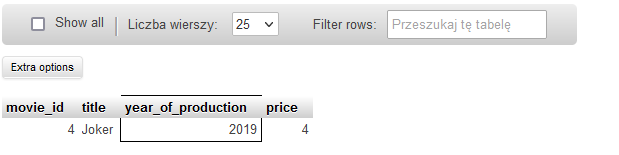

#### 3. Wyświetl wszystkie filmy, które powstały między 1900, a 1999 rokiem.

SELECT * FROM `movies` WHERE year_of_production BETWEEN 1900 AND 1999;

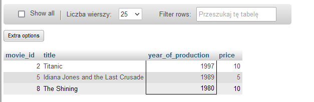

#### 4. Wyświetl JEDYNIE tytuł i cenę filmów, które kosztują poniżej 7$

SELECT title, price FROM `movies` WHERE price < 7;

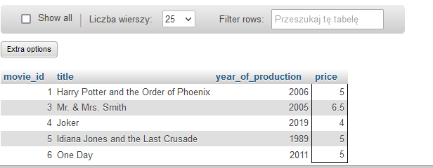

#### 5. Użyj operatora logicznego AND, aby wyświetlić aktorów o actor_id pomiędzy 4-7 (4 i 7 powinny się wyświetlać). NIE UŻYWAJ operatora BETWEEN.

SELECT * FROM `actors` WHERE actor_id >= 4 AND actor_id <=7;

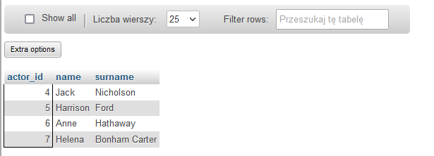

#### 6. Wyświetl klientów o id 2,4,6 wykorzystaj do tego warunek logiczny.

SELECT * FROM `customers` WHERE customer_id = 2 OR  customer_id = 4  customer_id = 6;

lub z użyciem modulo:

SELECT * FROM `customers` WHERE (customer_id % 2) = 0;

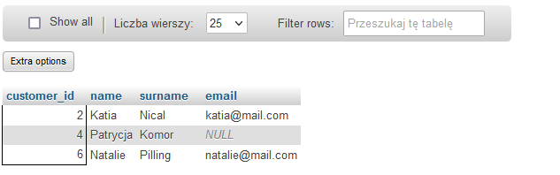

#### 7. Wyświetl klientów o id 1,3,5 wykorzystaj do tego operator IN.

SELECT * FROM `customers` WHERE customer_id IN (1,3,5);

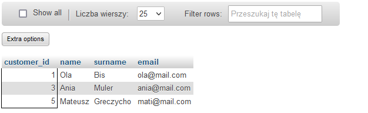

#### 8. Wyświetl dane wszystkich osób z tabeli ‘actors’, których imię zaczyna się od ciągu “An”.

SELECT * FROM `actors` WHERE name LIKE 'An%';

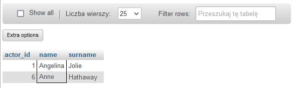

#### 9. Wyświetl dane klienta, który nie ma podanego adresu email.

SELECT * FROM `customers` WHERE email IS NULL;

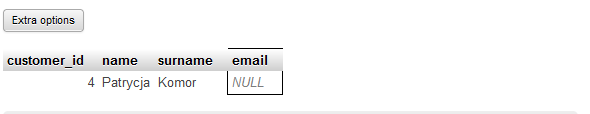

#### 10. Wyświetl wszystkie filmy, których cena wynosi powyżej 9$ oraz ich ID mieści się pomiędzy 2 i 8 movie_id.

SELECT * FROM `movies` WHERE price > 9 AND movie_id BETWEEN 2 AND 8;

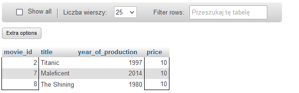

## TASK 6
### Subtask 1

SQL part 2

#### 11. Popełniłam błąd wpisując nazwisko Ani Miler – wpisałam Muler. Znajdź i zastosuj funkcję, która poprawi mój karkołomny błąd 🙈

UPDATE customers SET surname = 'Miler' where surname = 'Muler';

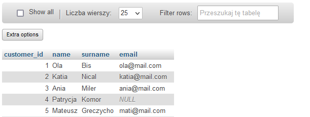

#### 12. Pobrałam za dużo pieniędzy od klienta, który kupił w ostatnim czasie film o id 4. Korzystając z funkcji join sprawdź, jak ma na imię klient i jakiego ma maila. 

SELECT customers.name, customers.email 
FROM customers 
JOIN sale ON 
customers.customer_id = sale.customer_id 
WHERE movie_id = 4;

#### 13. Na pewno zauważył_ś, że sprzedawca zapomniał wpisać emaila klientce Patrycji. Uzupełnij ten brak wpisując: pati@mail.com

UPDATE customers SET email = 'pati@mail.com' WHERE email IS NULL;

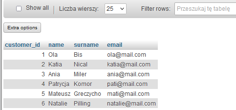

#### 14. Dla każdego zakupu wyświetl imię i nazwisko klienta, który dokonał wypożyczenia oraz tytuł wypożyczonego filmu. (wykorzystaj do tego funkcję inner join, zastanów się wcześniej, które tabele Ci się przydadzą do wykonania ćwiczenia).

SELECT customers.name, customers.surname, movies.title
FROM ((customers INNER JOIN sale ON customers.customer_id = sale.customer_id)
INNER JOIN movies ON sale.movie_id = movies.movie_id);

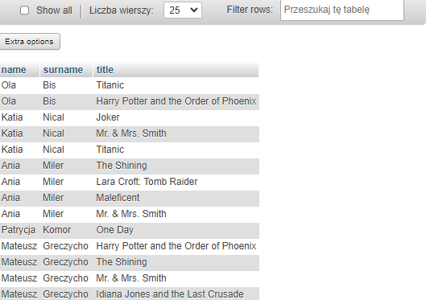

#### 15. W celu anonimizacji danych, chcesz stworzyć pseudonimy swoich klientów. 
- Dodaj kolumnę o nazwie ‘pseudonym’ do tabeli customer,

  ALTER TABLE customers ADD pseudonym text;

  
  
- Wypełnij kolumnę w taki sposób, aby pseudonim stworzył się z dwóch pierwszych liter imienia i ostatniej litery nazwiska. Np. Natalie Pilling → Nag

UPDATE customers SET pseudonym = CONCAT(LEFT(name, 2), RIGHT(surname,1));

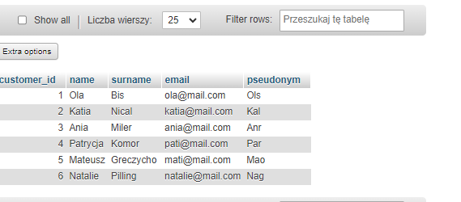

#### 16. Wyświetl tytuły filmów, które zostały zakupione, wyświetl tabelę w taki sposób, aby tytuły się nie powtarzały.

SELECT DISTINCT movies.title, movies.movie_id FROM movies JOIN sale ON movies.movie_id = sale.movie_id;

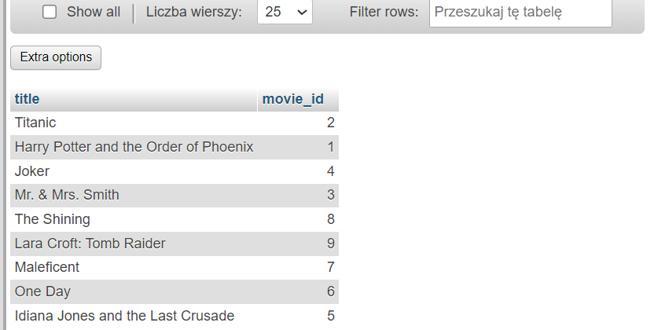

#### 17. Wyświetl wspólną listę imion wszystkich aktorów i klientów, a wynik uporządkuj alfabetycznie. (Wykorzystaj do tego funkcji UNION)

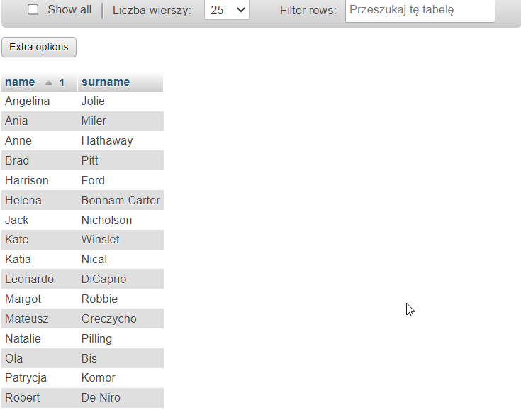

